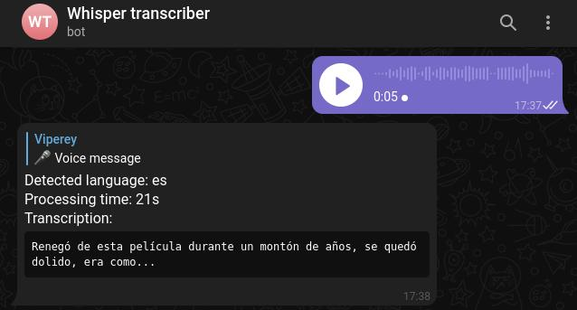

# Whisper transcriber (telegram bot)

Another whisper transcriber.  
Simple, yet functional voice message transcriber.  
Add this bot to your group chat or use it directly by sending the voice messages to the bot (`@whispering_for_chaos_bot`).  



---
## How to

### Create the bot

Via: `@BotFather`.  
Copy the token, you'll need it in the next step.

### Run it

```shell
cp docker-compose.example.yaml docker-compose.yaml
# Add the token value from the previous step and add your desired chat id
docker-compose up
# or, if you have Taskfile installed:
task docker:run
```

### Use it

If you want to simply test, open an issue mentioning your `chat_id` and I'll add it to my private running instance.

---
## Disclaimer

This bot only works in groups, not in private conversations.  
Alternatively, you can forward an audio message to the bot `@whispering_for_chaos_bot` and it will pick it up.

---
## Bibliography

+ https://developer.vonage.com/blog/21/10/01/python-environment-variables-a-primer
+ https://www.nylas.com/blog/making-use-of-environment-variables-in-python/
+ https://github.com/python-telegram-bot/python-telegram-bot
+ https://github.com/python-telegram-bot/python-telegram-bot/wiki/Extensions-%E2%80%93-Advanced-Filters
+ https://gladia.io/openais-open-source-whisper-is-changing-the-speech-recognition-game/
+ https://huggingface.co/blog/fine-tune-whisper
+ https://github.com/chidiwilliams/buzz
+ https://github.com/openai/whisper/discussions/2


## TODO

+ [-] Edit the results by iterating from smallest to largest (capped by the env var)
